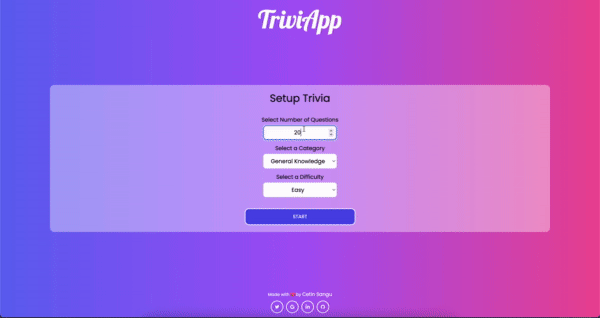

# <a href="https://triviapp.cetinsangu.com">TriviApp</a>: A Trivia App With 1000+ Questions, Multiple Categories and Difficulties | ReactJS, Axios, OpenTDB, Tailwind CSS

- Test your knowledge on everything!

- I developed a dynamic web application utilizing ReactJS, Axios, Tailwind CSS, and the OpenTDB API. The project encompasses a vast collection of over 4000 questions, organized into selectable categories and varying difficulty levels. Users have the freedom to choose the number of questions they want to tackle. The application not only presents questions but also tracks user performance, showcasing success rates, correct answers, and incorrect answers. Through this project, I successfully integrated multiple technologies to create an interactive and informative platform for users to engage with a wide array of questions and assess their progress.

# Tech Stack

- ReactJS

- Hooks: UseState
- ContextAPI

- Axios

- Tailwind CSS
